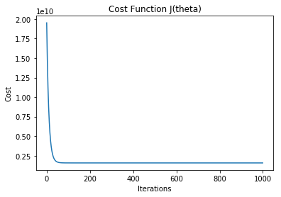

# GradientDescentLinearRegression
Performs gradient descent for Linear Regression in Python


```python
#Gradient Descent for Linear Regression
import pandas as pd
import numpy as np
import matplotlib.pyplot as plt
import matplotlib.animation as animation
#Contains the housing prices data https://www.kaggle.com/c/house-prices-advanced-regression-techniques
data = pd.read_csv('train.csv')
```


```python
X = data['GrLivArea']
y = data['SalePrice']
```


```python
#Feature Scaling
X = (X - X.mean()) / X.std()
#Add X0 (Columns of 1)
X = np.c_[np.ones(X.shape[0]), X]
```


```python
#Grad descent parameters
Alpha = 0.05
Iterations = 1000
m = y.size #number of training examples
theta = np.random.rand(2) #assign theta0 and theta 1 to random numbers

```


```python
def gradient_descent(alpha,iterations,x,y,theta_initial):
    old_costs = []
    thetas = [theta_initial]
    for j in range(iterations):
        prediction = np.dot(X,theta_initial) #dot product calculates h of x
        error = prediction -y
        cost = 1/(2*m) * np.sum(error**2) 
        old_costs.append(cost)
        theta_initial = theta_initial - (alpha* (1/m)* np.dot(x.T, error)) #update theta
        thetas.append(theta_initial)
            
    return old_costs, thetas            
```


```python
costs, thetas = gradient_descent(Alpha,Iterations,X,y,theta)
theta = thetas[-1]
print("Gradient Descent: {:.2f}, {:.2f}".format(theta[0], theta[1]))
```

    Gradient Descent: 180921.20, 56294.90
    


```python
plt.title('Cost Function J(theta)')
plt.xlabel('Iterations')
plt.ylabel('Cost')
plt.plot(costs)
plt.show()
```



